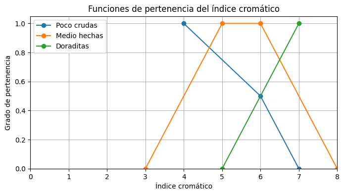
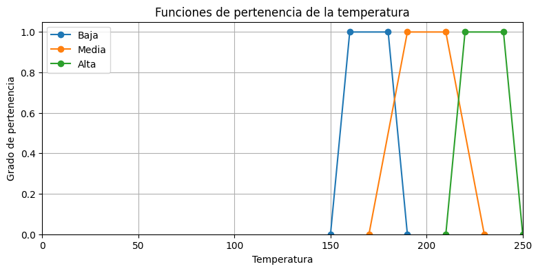

# Ejercicio de lógica difusa con Fuzzy CLIPS
## Las galletas de la abuela María

**Autores:** `Alejandro Gálvez | Manuel Dueñas`

# Descripción del proyecto

Este proyecto utiliza Fuzzy Clips para modelar un sistema de lógica difusa que ayuda a determinar el tiempo de horneado ideal para las galletas de la abuela María con el objetivo de lograr una cocción perfecta, basándose en los siguientes factores:

- **Índice cromático**: Representa el nivel de cocción de las galletas (poco crudas, medio hechas y doraditas), usando funciones de pertenencia en un rango de 0 a 8.

- **Temperatura del horno**: Representa la temperatura del horno (baja, media y alta), con valores entre 0 y 250 grados.


### Índice cromático correspondiente a las galletas:

* un poco crudas: (1/4, 0.5/6, 0/7)
* medio hechas: (0/3, 1/5, 1/6, 0/8)
* doraditas: (0/5, 1/7)




### Temperatura del horno (°C):
* baja: (0/150, 1/160, 1/180, 0/190)
* media: (0/170, 1/190, 1/210, 0/230)
* alta: (0/210, 1/220, 1/240, 0/250)




## Se establecen reglas difusas:

* Si las galletas están poco crudas, se recomienda una temperatura media.
* Si están medio hechas, se asigna una temperatura alta.
* Si están doraditas, se usa una temperatura baja para evitar que se quemen.


Finalmente, en deffacts, se ingresan hechos iniciales que representan el estado actual de las galletas, permitiendo que el sistema evalúe las reglas y determine automáticamente la temperatura más adecuada.

# Ejecución del programa

Para ejecutar el programa es necesario seguir los siguientes pasos:

1. Tener instalado FuzzyClips en tu sistema.
2. Clonar el repositorio 
```bash
git clone https://github.com/AGALMAD/expert_system_exercise.git
```
4. Tener el archivo FuzzyClips.exe en la misma carpeta que el repositorio clonado.
5. Ejecutar FuzzyClips.exe.
6. Ejecutar el siguiente comando en la consola de FuzzyClips:
```bash
(batch "galletas/run.clp")
```

